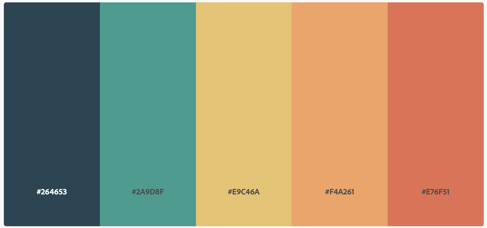

# What Makes a Woman?
### High Fidelity Prototype

### Final dataset used
topicsDataReformattedHardcoded.json

### Color Scheme Change
I changed the color scheme after multiple comments that my original choice was biased. I decided on a more neutral palette. The new color palette is:

### Things to Note
* Topics were split into 5 main groups (Science and Technology, Entertainers, Politics, Writers, and Society and Social Change). I only looked at topics pertaining to woman’s careers. I filtered out topics about the background of the image (i.e. chair, flowers) or the woman’s appearance (i.e. necklace, costume).
* Most of the politics topics pertain to women whose husbands work in politics, however I decided to still look at this genre because being a First Lady is still a career.
* The data analyzed is only the CC0 licensed data available through Smithsonian open access. The data does not account for all of the portraits of women in The National Portrait Gallery.
* I chose the dates 1900-1940 primarily because of the small set of data that is CC0 licensed. I took what I had to work with and then chose those takes secondly because it gives time before and after the women’s suffrage movement.
* There are 182 portraits analyzed overall

### Findings
* There are a lot of portraits with entertainer topics throughout the years (except for 1930 where this number is low)
* Society and social change topics are high in 1900 and 1910 which may be because of the women’s suffrage movement
* The number of entertainer topics are high in the 1920s which may be because of the roarings 20s
* The topic of science and technology is small throughout all of the years, I wonder if this would grow if there were more data on the later years (I didn’t look at later years because the data wasn’t available)
* Writers topics are really high in 1900 and then dwindle down

### Possible Explanation on Topic Variety (Something to think about):

An important thing to note is that looking beyond woman’s representation throughout the years, the national portrait gallery just might not have portraits of women in particular fields (they may be missing from the CC0 enabled data but also may be missing from the collection as a hold). So, it may go beyond women’s representation in these actual fields and be more about the collection of women’s portraits that The NPG has.

### Next Steps
* Turn prototype into interactive webpage that looks like prototype on GitHub pages
* Make path to get final dataset through code (right now it is done manually)
* Possibly add more data, look at portraits of women in other collections as well
* Possibly incorporate images into the visual so when you roll your mouse over a bar a portrait pops up. Possibly explore this for Qualitative Visualization.
* Possibly have another bar graph with subgroups pop up when you click on a bar.
