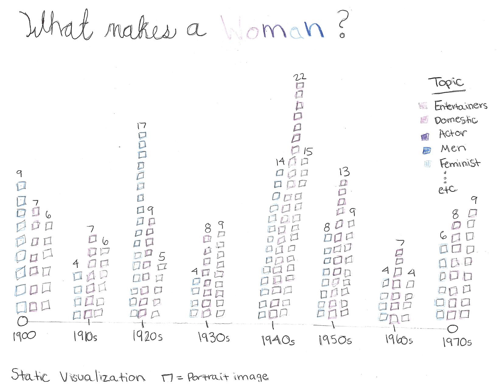
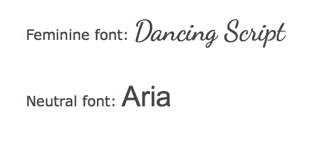

# What Makes a Woman? 
### A visualization of portraits of women in The Smithsonian National Portrait Gallery by Isabel Stoddart

## Data

Smithsonian National Portrait Gallery Open Access Data queried by woman, online media: images, catalog record source: National Portrait Gallery

Data from Smithsonian Open Access Website: https://collections.si.edu/search/results.htm?fq=online_media_type%3A%22Images%22&fq=data_source%3A%22National+Portrait+Gallery%22&q=woman&media.CC0=true

2647 Records

## Description of Visualization

The visualization is a static bar graph along a timeline from 1900 to 1970. Above each year there will be 5 columns of portrait images pertaining to each topic I am looking at. The images will be backed with the color that represents their topic. The topics will be color coded on the pink to blue color spectrum. The background will be white. The title will be displayed in either the top left corner or the top middle.

The purpose of the visualization is to display the change in female portraits through the 1900s and the change in what women are represented for. I hope to see a pattern of better representation as the years go on. 

## One Concern

Data is skewed because only some of the artifacts are in the database leaving out the ones from past the 1950s

## Further 

Change query to print out date and topic for each piece (get codes for this)
develop visualization using p5.js or d3.js (whichever can give the best visual)
figure out how to get images downloaded so they can be used for bar chart
possibly shrink span of dates on api request (1900s) is it okay if this just makes it 179 records?
narrow down the topics I want to look at or group them together to make the visual less heavy (top 5 topics?)

## Goal of Visualization 

To visualize the portrayal of women over the years by looking at topics linked to each portrait. 

## Questions Asked 

* How has the portrayal of women changed over time? 
* Do the topics linked to each portrait change at all over the years?
* Does women’s representation grow in later years?
* Topics: distribute by top 10 topics? distribute by my top 10 topics I’m interested in?

## Topics I’m interested to see the distribution of 

Entertainers, Education, Men (how many portraits of women also have men in them), Society and social change, politics, military, religion, dancer, feminist, women’s rights advocate

## Color Scheme

While asking what color represents women, my first thought was pink, but my second thought was how that can be problematic, especially these days when there is no one thing that defines a woman. I decided to use a color scheme on the spectrum between pink and blue to categorize the topics as well as for “Women” in my title.

## Background

Neutral color (Black or White)

## Type Font

### Title

For the words “What makes a” I am using a cursive more feminine font and then for “Women” I am using a neutral font to draw a contrast to what people may think a women (feminine) is versus what a women really is (neutral, a women can be feminine or not)

### Other Text

I am going to use the neutral font for all the other text

Feminine font: Dancing Script

Neutral font: Aria
